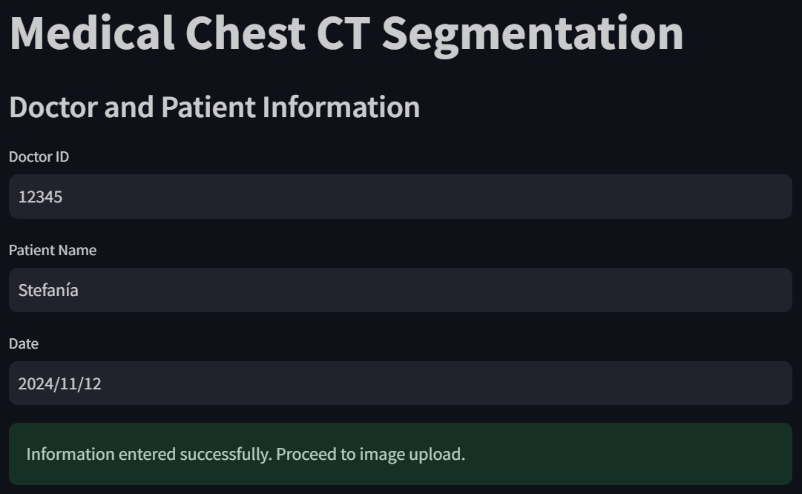

# Interactive Deep Learning Application for Lung CT Segmentation

This project explores the application of deep learning for automatic lung segmentation from chest CT images. Two different approaches were implemented and compared: a U-Net model developed from scratch and a Transfer Learning model using a pre-trained VGG16 encoder.

The trained models were deployed in an interactive Streamlit application designed to provide an intuitive workflow for medical image segmentation.

Developed as the final project for the Digital Image Processing course at Pontificia Universidad Javeriana Cali.

---

## Application

<p align="center">
  
</p>

The application allows users to:

- Register patient information.
- Upload a chest CT image.
- Select one or both segmentation models.
- Generate segmentation predictions.
- Compare the outputs of both models.

---

## Overview

Manual segmentation of lung structures in chest CT scans is a time-consuming process that requires expert knowledge. This project investigates the use of deep learning techniques to automate this task by comparing two segmentation approaches under the same conditions.

The first model consists of a U-Net architecture developed from scratch, while the second incorporates a pre-trained VGG16 encoder through Transfer Learning. Both models were integrated into a Streamlit application to demonstrate how deep learning models can be deployed in a practical and user-friendly interface.

---

## Deep Learning Models

### U-Net from Scratch

A U-Net architecture was implemented and trained specifically for binary lung segmentation.

### Transfer Learning

A second architecture was implemented using a pre-trained VGG16 encoder within the U-Net framework. This approach leverages previously learned image representations to improve segmentation performance on limited datasets.

---

## Application Workflow

The segmentation process consists of the following steps:

1. Register doctor and patient information.
2. Upload a chest CT image.
3. Select the segmentation model.
4. Generate the prediction.
5. Visualize the segmentation mask.
6. Compare both models when desired.

---

## Technologies

- Python
- TensorFlow
- Keras
- Streamlit
- OpenCV
- NumPy
- Matplotlib

---

## Repository Structure

```text
lung-ct-segmentation
│
├── app.py
├── chest_ct_app.py
├── model_handler.py
├── image_processor.py
├── history_handler.py
├── history_loader.py
├── metrics.py
├── requirements.txt
└── README.md
```

---

## Installation

Clone the repository

```bash
git clone https://github.com/yourusername/lung-ct-segmentation.git
```

Install the required packages

```bash
pip install -r requirements.txt
```

Run the application

```bash
streamlit run app.py
```

---

## Results

Both deep learning models successfully segmented lung regions from chest CT images.

The implementation highlights the impact of Transfer Learning in biomedical image segmentation and demonstrates how trained models can be integrated into an interactive application for practical use.

---

## Authors

Jerónimo Delvasto Ávila

Stefanía Bravo Guzmán

Biomedical Engineering

Pontificia Universidad Javeriana Cali
